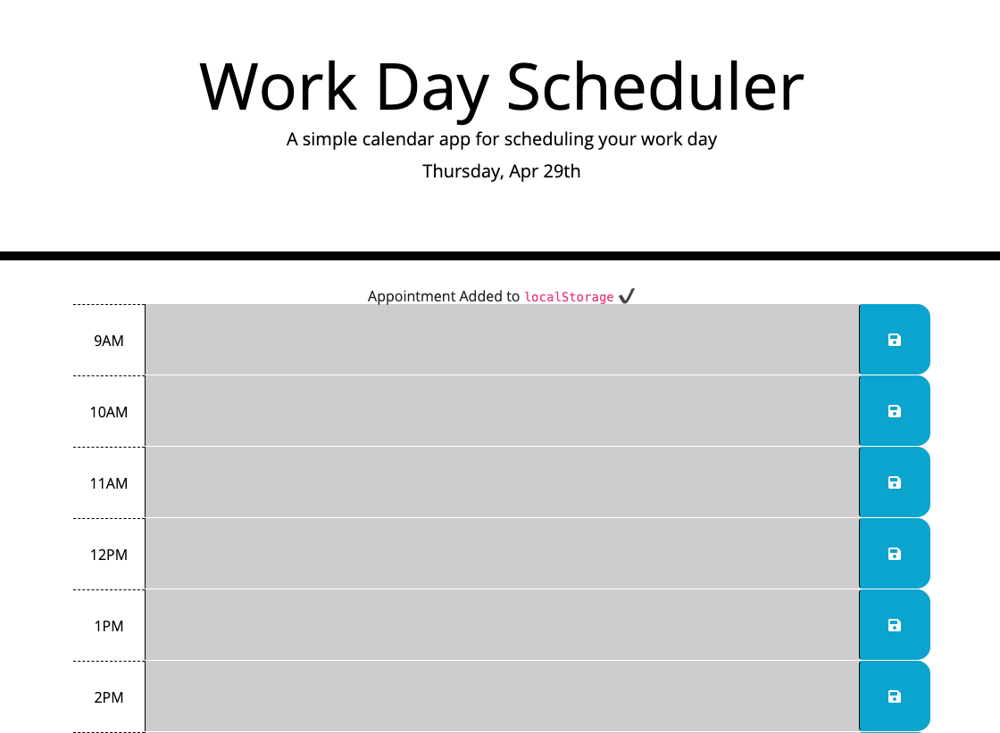

# WorkSch-3rdPartyAPIs

## Description

This project is a web application that serves as a day planner. The homework assingment utilizes HTML, CSS, and jQuery.

## Installation

No installation is required for the utilization of the site.

## Usage

Upon opening the webpage, the user can add text to the time blocks and save to local storage. The time block's colors correspond to the time of day.

 `

Link to webpage: https://lhwood.github.io/WorkSch-3rdPartyAPIs/

## Credits

Nothing to note outside of class materials
